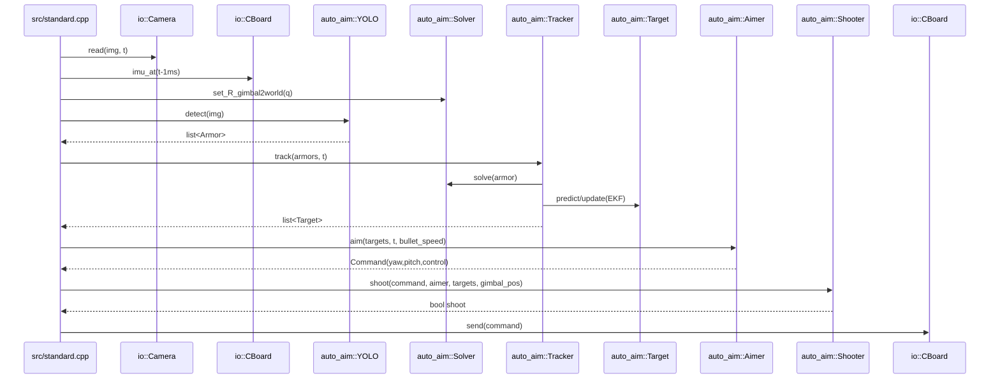
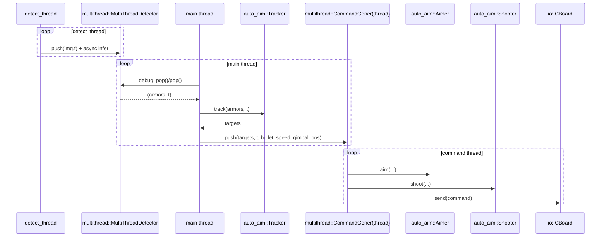
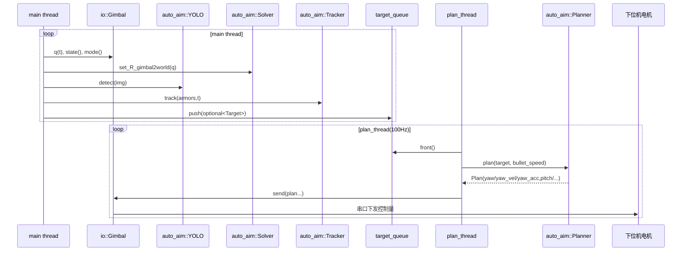

# auto_aim 调用时序图 + YAML 参数清单（用于调参）

## 1. 目标与范围
本文是对 `tasks/auto_aim` 的补充文档，聚焦两件事：

1. 运行调用时序（谁先调用谁，数据如何流动）
2. 配置参数映射（`yaml` 键 -> 代码逻辑 -> 调参影响）

说明：
- 模型推理细节不展开（与调参关系弱）。
- 时序按当前工程主用三条链路给出：`standard`、`mt_standard`、`standard_mpc`。

---

## 2. 调用时序图

## 2.1 单线程自瞄链路（`standard.cpp` 风格，Aimer控制）

关键时序点：
- `Solver` 必须在 `Tracker` 前更新旋转矩阵，否则世界坐标错误。
- `Aimer` 内部还会做“预测时延 + 弹道飞行时间迭代”。
- `Shooter` 是最后门控，防止突变命令下误发射。

---

## 2.2 多线程自瞄链路（`mt_standard.cpp` 风格）

关键时序点：
- 检测与控制解耦，吞吐更稳。
- `CommandGener` 总是只取“最新输入”，天然有丢旧帧策略（低延迟优先）。

---

## 2.3 MPC链路（`standard_mpc.cpp` / `auto_aim_debug_mpc.cpp`）

关键时序点：
- `Planner` 使用 `Target` 预测轨迹，输出连续状态控制量（不是单个 yaw/pitch 命令）。
- 串口通信在 `io::Gimbal` 内部封装，`main` 层只看 `send()`。

---

## 3. YAML 参数清单（键 -> 逻辑 -> 调参影响）

## 3.1 识别入口选择与模型

| YAML键 | 读取位置 | 生效链路 | 逻辑作用 | 调参影响 |
|---|---|---|---|---|
| `yolo_name` | `yolo.cpp`, `multithread/mt_detector.cpp` | 全部YOLO链路 | 选择 `yolov5/yolov8/yolo11` 实现与对应模型键 | 决定检测后处理分支 |
| `yolov5_model_path` | `yolos/yolov5.cpp` | `yolo_name=yolov5` | 模型文件路径 | 错误会直接加载失败 |
| `yolov8_model_path` | `yolos/yolov8.cpp` | `yolo_name=yolov8` | 模型文件路径 | 同上 |
| `yolo11_model_path` | `yolos/yolo11.cpp` | `yolo_name=yolo11` | 模型文件路径 | 同上 |
| `classify_model` | `classifier.cpp` | 传统Detector、YOLOV8二级分类 | 图案分类网络路径 | 影响编号识别稳定性 |
| `device` | YOLO各实现、`mt_detector.cpp` | YOLO链路 | OpenVINO设备（CPU/GPU等） | 影响时延与吞吐 |

## 3.2 检测阈值与ROI

| YAML键 | 读取位置 | 生效链路 | 逻辑作用 | 调参建议 |
|---|---|---|---|---|
| `min_confidence` | `detector.cpp`, `yolov5/8/11.cpp` | 传统+YOLO | 分类/检测置信度过滤 | 高了漏检，低了误检 |
| `use_roi` | `yolov5/8/11.cpp` | YOLO | 是否裁剪ROI推理 | 先关后开，先稳后快 |
| `roi.x/y/width/height` | `yolov5/8/11.cpp` | YOLO+ROI | ROI区域定义 | 过小会丢目标 |
| `use_traditional` | `yolov5.cpp` | YOLOv5 | 是否用传统法二次矫正角点 | 提高角点精度但增加耗时 |

## 3.3 传统检测几何参数（Detector）

| YAML键 | 读取位置 | 逻辑作用 | 调参建议 |
|---|---|---|---|
| `threshold` | `detector.cpp`, `yolov5/8/11.cpp` | 二值化阈值（传统） | 随曝光/光照联调 |
| `max_angle_error` | `detector.cpp` | 灯条角度容差 | 太小漏检，太大误检 |
| `min_lightbar_ratio` / `max_lightbar_ratio` | `detector.cpp` | 灯条长宽比过滤 | 与镜头畸变相关 |
| `min_lightbar_length` | `detector.cpp` | 灯条最小长度 | 抗远距噪声 |
| `min_armor_ratio` / `max_armor_ratio` | `detector.cpp` | 装甲板宽高比过滤 | 防止伪目标 |
| `max_side_ratio` | `detector.cpp` | 左右灯条长度一致性 | 太严会漏斜视目标 |
| `max_rectangular_error` | `detector.cpp` | 矩形几何误差阈值 | 太松误检增加 |

## 3.4 解算参数（Solver）

| YAML键 | 读取位置 | 逻辑作用 | 调参建议 |
|---|---|---|---|
| `R_gimbal2imubody` | `solver.cpp` | IMU体坐标与云台坐标关系 | 标定后固定 |
| `R_camera2gimbal` | `solver.cpp` | 相机到云台旋转外参 | 偏差直接引入角度误差 |
| `t_camera2gimbal` | `solver.cpp` | 相机到云台平移外参 | 影响近距解算误差 |
| `camera_matrix` | `solver.cpp` | 相机内参 | 重投影基础 |
| `distort_coeffs` | `solver.cpp` | 畸变参数 | 影响边缘目标精度 |

## 3.5 跟踪状态机（Tracker）

| YAML键 | 读取位置 | 逻辑作用 | 调参建议 |
|---|---|---|---|
| `enemy_color` | `tracker.cpp` | 敌我颜色过滤 | 必须与比赛方一致 |
| `min_detect_count` | `tracker.cpp` | lost->detecting->tracking门限 | 大则稳，小则快 |
| `max_temp_lost_count` | `tracker.cpp` | 普通目标临时丢失容忍帧数 | 提高抗遮挡能力 |
| `outpost_max_temp_lost_count` | `tracker.cpp` | 前哨站专用丢失容忍 | 前哨站建议更大 |

## 3.6 Aimer（非MPC链路）

| YAML键 | 读取位置 | 生效链路 | 逻辑作用 | 调参建议 |
|---|---|---|---|---|
| `yaw_offset` / `pitch_offset` | `aimer.cpp` | `Aimer`链路 | 静态角度零偏补偿 | 先静态归零 |
| `comming_angle` / `leaving_angle` | `aimer.cpp` | `Aimer`链路 | 小陀螺装甲选择门限 | 决定“打哪块板” |
| `decision_speed` | `aimer.cpp`, `planner.cpp` | Aimer+Planner | 高低速延时分段阈值 | 与目标角速度匹配 |
| `high_speed_delay_time` / `low_speed_delay_time` | `aimer.cpp`, `planner.cpp` | Aimer+Planner | 链路总时延补偿 | 直接影响提前量 |
| `left_yaw_offset` / `right_yaw_offset` | `aimer.cpp` | 哨兵双枪模式 | 左右枪口偏置补偿 | 没配置则退回`yaw_offset` |

## 3.7 Shooter（非MPC链路）

| YAML键 | 读取位置 | 生效链路 | 逻辑作用 | 调参建议 |
|---|---|---|---|---|
| `first_tolerance` | `shooter.cpp` | Aimer+Shooter链路 | 近距开火容差 | 过小会“憋枪” |
| `second_tolerance` | `shooter.cpp` | Aimer+Shooter链路 | 远距开火容差 | 远距通常更严格 |
| `judge_distance` | `shooter.cpp` | Aimer+Shooter链路 | 近远距切换阈值 | 按有效射程设 |
| `auto_fire` | `shooter.cpp` | Aimer+Shooter链路 | 是否允许自动开火 | 联调时可先关 |

## 3.8 Planner（MPC链路）

| YAML键 | 读取位置 | 生效链路 | 逻辑作用 | 调参建议 |
|---|---|---|---|---|
| `yaw_offset` / `pitch_offset` | `planner.cpp` | MPC | 目标角零偏补偿 | 与Aimer同源 |
| `fire_thresh` | `planner.cpp` | MPC | 计划轨迹与参考误差开火阈值 | 小=保守，大=积极 |
| `max_yaw_acc` / `max_pitch_acc` | `planner.cpp` | MPC | 输入加速度约束 | 限制“快但抖” |
| `Q_yaw` / `Q_pitch` | `planner.cpp` | MPC | 状态误差权重 | 大=更跟踪参考 |
| `R_yaw` / `R_pitch` | `planner.cpp` | MPC | 控制输入权重 | 大=更平滑 |

---

## 4. “链路-参数”生效矩阵（便于避免误调）

| 参数组 | standard / mt_standard（Aimer） | standard_mpc / auto_aim_debug_mpc（Planner） |
|---|---|---|
| YOLO/Detector/Solver/Tracker | 生效 | 生效 |
| Aimer参数（`comming/leaving`） | 生效 | 不生效 |
| Shooter参数（`first/second_tolerance`等） | 生效 | 不生效 |
| Planner参数（`Q/R/max_acc/fire_thresh`） | 不生效 | 生效 |
| CBoard参数（can id等） | 生效（CBoard程序） | 不生效（Gimbal程序） |
| Gimbal参数（`com_port`） | 不生效（CBoard程序） | 生效（Gimbal程序） |

---

## 5. 推荐调参顺序（按 readme 的“分层解耦”思想）

1. 相机输入先稳定：`exposure/gain`  
2. 解算先可信：`内参+外参`（先看重投影）  
3. 检测再调阈值：`min_confidence/ROI/geometry`  
4. 跟踪再调状态机：`min_detect_count/temp_lost`  
5. 最后调控制：  
   - Aimer链路：`offset + delay + shooter tolerance`  
   - MPC链路：`offset + delay + Q/R/max_acc + fire_thresh`

一句话原则：
- 一次只调一层，避免“检测误差被控制参数掩盖”。

---

## 6. 快速检查清单（上车前）

1. `yolo_name` 与对应模型路径匹配。
2. `enemy_color` 确认与比赛一致。
3. 若是 MPC 程序，确认 `com_port` 可用且下位机协议匹配。
4. 若是 CBoard 程序，确认 `can_interface` 与 can id 正确。
5. 当前程序链路下，确认你调的参数“真的会生效”（见第4节矩阵）。

